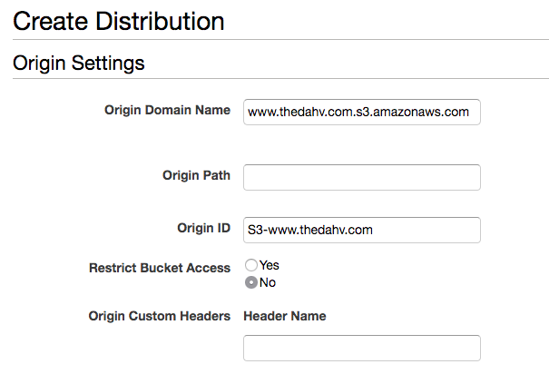
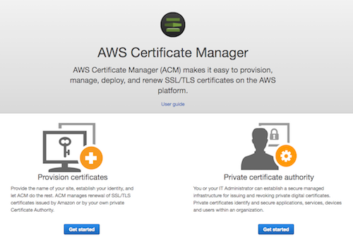
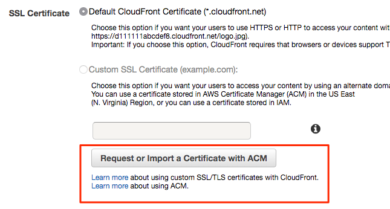
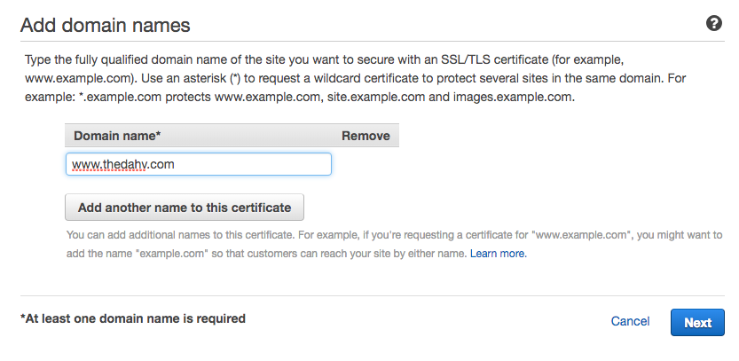
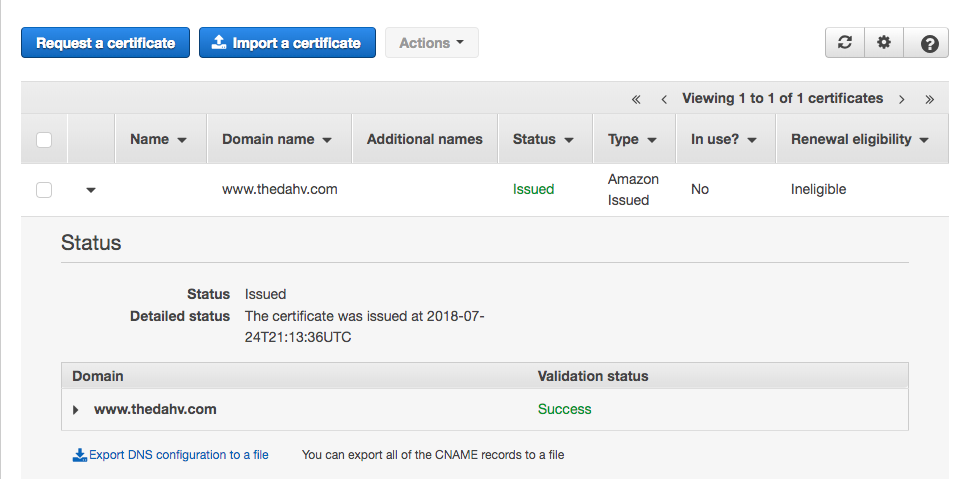
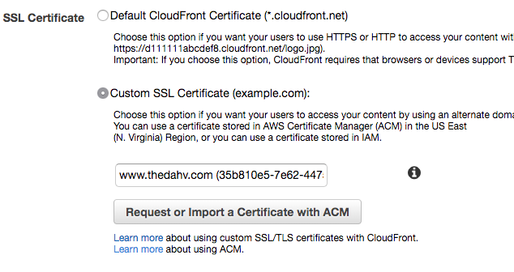
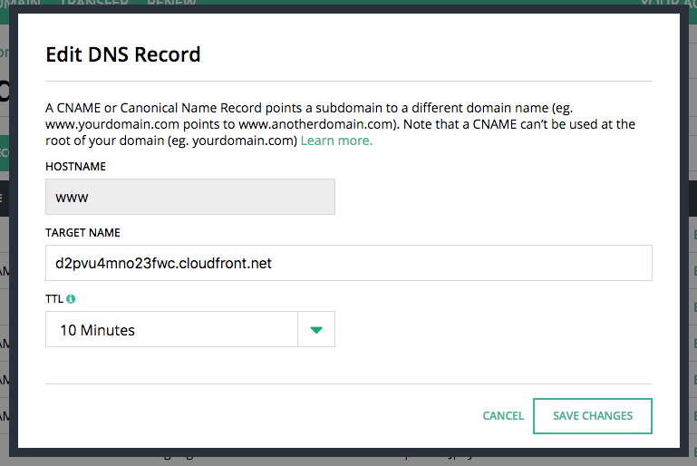
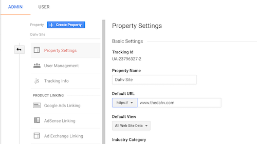
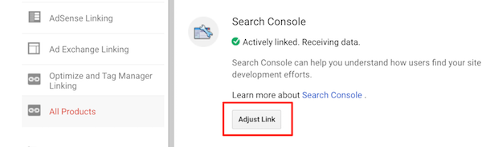

If you haven't heard, Google cares about site owners implementing https on their
websites. They took a big step on 24 July 2018 with their Chrome browser:

- [A milestone for Chrome security: marking HTTP as "not
  secure"](https://www.blog.google/products/chrome/milestone-chrome-security-marking-http-not-secure/)
  (Google)
- [A secure web is here to
  stay](https://security.googleblog.com/2018/02/a-secure-web-is-here-to-stay.html) (Google)
- [Chrome now marks all unencrypted websites as ‘not
  secure’](https://www.theverge.com/2018/7/24/17603126/google-chrome-unencrypted-not-secure)
  (The Verge)

If you are reading this, there is a good chance you're already familiar with
HTTPS and its impact on the web. Rather than explain all again, I hope to
leave you with two things:

- Why HTTPS still matters for static sites
- How to migrate a static site hosted on AWS S3 to HTTPS in about 20-30 minutes

## Why HTTPS Matters for Static Sites

Until recently, my website was served over unsecured HTTP. Moving to
HTTPS was on my list, but my site is minimalistic and I didn't have much
urgency:

- I don't track cookies
- I don't load much in the way of external images or scripts — and even those are
over HTTPS
- there are no forms submitting to a server
- there is no data I want or could possibly steal from a visitor

I thought the risk was pretty low. However, protecting my visitors from *me*
isn't the point.

If you're reading this and think the end goal for implementing HTTPS is for an
SEO boost because Google said [site security is a small, but growing, ranking
factor](https://webmasters.googleblog.com/2014/08/https-as-ranking-signal.html),
you're also missing the forest for the trees.

Google tells us they want to help create a safer Internet, and encouraging site owners with
SEO rewards — or penalties — is an incentive to do the right thing:

> …we’re also working to make the Internet safer more broadly. A big part of that
> is making sure that websites people access from Google are secure. For
> instance, we have created resources to help webmasters prevent and fix
> security breaches on their sites.

> For now it's only a very lightweight signal — affecting fewer than 1% of
> global queries, and carrying less weight than other signals such as
> high-quality content — while we give webmasters time to switch to HTTPS. But
> over time, we may decide to strengthen it, **because we’d like to encourage all
> website owners to switch from HTTP to HTTPS to keep everyone safe on the
> web.**

_Note: emphasis mine_

Here is the real reason: **the Internet is not inherently safe and you don't
control what happens between a user's browser and your web server**. There are
many opportunities to exploit unsecured connections along the way, and
unsecured websites help enable that exploitation.

You should watch Troy Hunt's ["Here's Why Your Static Website Needs HTTPS"
](https://www.troyhunt.com/heres-why-your-static-website-needs-https/) blog post
and video series where he demonstrates what can go wrong on even the simplest
websites. Some of the examples are a bit technical, but it's worth taking the
time to see the impact.

The main takeaway for you is HTTPS helps contribute to a safer Internet as your
users navigate from site to site.

## Securing Static Sites on AWS S3

I really like simple, static websites as a content solution, and I plan on
writing more about my experience soon. The big sells are: it's cheap,
reliable, fast, and simple if you're willing to learn a few new file-based
tools.

Let's focus on the migration. The overall process is:

- Create and configure a new Cloudfront distribution
- Obtain a free public SSL Certificate via AWS Certificate Manager
- Update DNS settings to point to Cloudfront
- Wait for DNS changes to propogate and then test out your site

I describe each section below and share some screenshots of the overall
workflow. I suggest reading all sections first before diving in to each step in
isolation as there are caveats.

**NOTE** this assumes you already have an AWS account and that you're already
serving a site from S3.

### Create a Cloudfront Distribution

[CloudFront](https://aws.amazon.com/cloudfront/) is the AWS content delivery
network. It seemed like an easy choice for me since it supports S3 integration
and I could manage billing and monitoring with one account.

AWS already offers [documentation for serving S3 buckets via
HTTPS](https://aws.amazon.com/premiumsupport/knowledge-center/cloudfront-https-requests-s3/).

Start by reading that, but read on to see my workflow and learn about some
"gotchas" I found.

First, you'll choose what kind of distribution you want. Choose "Web". Then
configure the source files CloudFront will distribute. Since you're logged in,
you should be able to configure CloudFront to read from one of your S3 buckets:

**IMPORTANT NOTES**

- The S3 picker gives you a domain that doesn't correspond to the public website
  domain for your S3 website. Be sure to modify it to use the public URL your
  DNS is currently using for web traffic. For example, CloudFront offered me
  `www.thedahv.com.s3.amazonaws.com`, but I needed
  `www.thedahv.com.s3-website-us-west-2.amazonaws.com`. You can find this in
  "Properties > Static website hosting" section of the [S3 management
  Console](https://s3.console.aws.amazon.com/).
- Find the "Viewer Protocol Policy" setting. I recommend setting it to "Redirect
  HTTP to HTTPS" so your users are always visiting your site securely. Plus,
  your analytics work will be simpler.

Once you create the distribution, you will be prompted to set up SSL certificate
settings. If you already have a valid certificate set up for your domain, use
that by all means.

However, read on if you're interested using a free alternative from AWS.

### Obtaining an SSL Certificate

SSL Certificates and Certificate Authorities let servers and browsers encrypt
content sent over their connections and ensure the veracity of that encryption.

AWS has [AWS Certificate Manager](https://aws.amazon.com/certificate-manager/)
that [integrates with
Cloudfront](https://docs.aws.amazon.com/acm/latest/userguide/acm-services.html),
and is [free for public
certificates](https://aws.amazon.com/certificate-manager/pricing/).

Compared to an alternative like [Let's Encrypt](https://letsencrypt.org/), this
is a compelling alternative if you want to stay within AWS.

The CloudFront distribution setup process embeds a certificate request workflow:

This will move you to the AWS Certificate Manager setup workflow. It will ask
for things like which domain pattern the certificate secures. I _recommend_ an
  exact URL to keep things specific, but you could set up a wildcard certificate
  that would work for any other sub-domains you may manage.

CloudFront seems to require that certificates issued by Certificate Manager
be associated with the `us-east-1` region. I couldn't figure out how to
specify the region when provisioning directly through this tool, but
requesting from within the CloudFront worfklow worked without issue.

Complete the workflow until you get a successfully issued and validated SSL
certificate. AWS may require you to verify ownership of your domain. If you've
ever set up a CNAME or a TXT record to verify Google Search Console or a similar
DNS-based verification process, this was no different.

Give your DNS host and AWS some time (10-20 minutes) to propogate the DNS
changes and verify the link. You'll eventually end up with a verified SSL
certificate:

**NOTE:** Unless AWS gives you a link back to the CloudFront workflow, you'll
either need to revisit the Distribution HTTPS setup page and refresh, or start
the setup workflow over again.

Back at the CloudFront setup workflow, the SSL certificate configured for your
domain should be available as a choice in the CloudFront setup:

## Update DNS Settings

Once the secured CloudFront distribution is set up, update the DNS settings with
your domain host to point your website URL to CloudFront instead of directly to
S3.

Find the domain name of the new distribution on "General" properties tab:

Then reconfigure your domain to point to this value. I use
[Hover](http://www.hover.com/) for my domain management and DNS configuration.

I updated the CNAME for `www.thedahv.com` to point to the CloudFront domain and
submitted my configuration change. From there, it may take 10-30 minutes for the
DNS settings to propogate.

## Follow-Up Items

At this point, you should have a secured static site running on AWS with
CloudFront and S3. Good for you!

Your work isn't done yet. Here are a few more related tasks to handle:

- **Set up domain redirects**  
  If your site is running on S3, you likely have a bucket redirecting from a
  naked domain to a sub-domain, or vice-versa. You may decide to also configure
  a similar https setup on the redirect bucket to minimize excessive redirect
  chains or complete any missing ones: (for example, `https://thedahv.com` ->
  `https://www.thedahv.com`)
- **Update your sitemap URLs**  
  If you use an automatic sitemap generator, update it to specify all the URLs
  should be served with https and re-upload it to S3. You may be using other
  tools that rely on sitemaps (Google Search Console, for example) and those
  should be updated as well
- **Update any internal absolute links**  
  All internal links on my site are relative, so I don't have to worry about
  specifying the protocol. However, scan the links on your site to update any
  absolute links you have.
- **Update canonical URL declarations on your pages**  
  It is a good idea to include a tag indicating each page on your site is the
  [canonical version](https://yoast.com/rel-canonical/). Make sure any tags
  rendered into your pages point to the URL with the correct protocol.
- **Update Google Analytics settings**  
  If you are using Google Analytics for your site, update the protocol for the default URL
  in View Settings and in Property Settings:  
  
- **Set up Google Search Console HTTPS property**  
  It appears Google Search Console [does not support migrating a property from
  http to https](https://support.google.com/webmasters/answer/83106). I created
  a new property, and updated my properties to declare this new property as the
  preferred source of search results.
- **Update Google Analytics link to Search Console**  
  If you've linked your Google Analytics property to a Google Search Console for
  search analytics in the Acquisition section, update it to point to the https
  property you created in the previous step. You will find this setting in
  "Admin > Property > Product Linking > All Product > Search Console". Delete
  the existing property and then click the "Adjust Link" button to choose your
  new property:  
  

## Wrapping Up

HTTPS helps create a better, more secure web. As it has been said many times
before, it is worthwhile and it is easy. Let me know if this helped you at all
or if you run into any issues.
