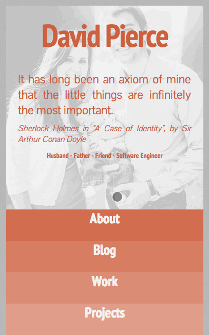

I've been working on resurrecting my web site in the last few weeks. I have
learned so much more about building engaging sites in my time at
[UP Global](http://www.up.co) and [Startup Weekend](http://www.startupweekend.org),
and my site did not reflect that.

More important than making things stand out, I value making interfaces clear
and intuitive. Still, the desire to innovate and create new experiences can
feel like a competing desire.

In a more recent example, I took a new approach to the home page navigation.
The software approach was stimulating, but the interface ended up confusing most
people who used it.

# HTML Trickery

First, I should explain how some parts of HTML and CSS excite me.

Most engaging interfaces involve some notion of affordance, state, and
transition. For example drawers have open and closed states. Buttons should tell
us if they are on or off.

Most developers turn to JavaScript to maintain this relationship among the
information. I have a lot of fun seeing how far I can take things with just HTML
and CSS.

For example, suppose I wanted to create a "show more" control to reveal more
information after a summary. It would look something like this:

A pretty common and basic jQuery approach would look like
[this](http://codepen.io/TheDahv/pen/efIpk). Note I'm not doing anything elegant
like updating the state of the open/close control. I could also take this a
step further and animate the transition.

For the most part, HTML nodes don't maintain much state unless you add
non-semantic attributes. But there are two standard HTML controls that do
maintain state: checkboxes and radio buttons.

There are a few key things to understand before we can leverage their behavior:

- CSS can target checkbox and radio state with `input:selected`
- CSS can use child and sibling selectors to affect DOM elements near the control
- Labels can affect the state of controls to which they are bound
- A developer can restyle labels and hide native input controls

In [this example](http://codepen.io/TheDahv/pen/wCbkd?editors=110), we achieve
the same open/close effect without JavaScript.

Granted, it is a bit more net code to manage, but it an interesting exercise
nonetheless. From here, a developer could continue to refine the experience with
CSS transitions.

The most beautiful thing to me is the more declarative approach to defining
interface behavior. JavaScript is one of my favorite languages, but I am still
telling the browser how to manipulate the DOM step by step.

It feels much more elegant to push CSS3 as far as it can go and describe to
the browser what should happen and let it do the heavy lifting.

# Radio Buttons for Menu Navigation

As I mentioned, it is fun for me to challenge myself and build with as little
JavaScript as possible. I took that approach to my home page navigation.

My goals here were to create a menu to my site where:

- the menu entries would reveal more information about that section of the site when opened
- the menu entries would distribute to fill up their allotted space on the user's screen

It ended up looking like this:

This was fun to build as a developer. Leveraging
[flexbox](http://css-tricks.com/snippets/css/a-guide-to-flexbox/) allowed me to
describe how the menu should arrange itself.

Using the radio button states yielded a menu that would close inactive items as
the active entry opened.

That layout didn't work particularly well on smaller device sizes. I was able to
change the flexbox configuration to rearrange the menu without any changes to
behavior.

# The Wrong Thing Built the Right Way is Still the Wrong Thing

We have a motto on our dev team: "The wrong thing build the right way
is still the wrong thing". I believe that applies to my initial approach
to what is essentially the "welcome mat" to my web site.

While I am still excited about how I built the menu, it confuses users because
it does not map nicely to what they expect and are used to.

Instead, I finally accepted what I suspected all along: I had built something
I thought was cool, but that wasn't empathetic to my audience.

As reluctant as I was to abandon approach, I ended up turning my menu
into standard links and simplified the experience.

Interestingly enough, the very next day, I ran across an article entitled
"[Hey, Designers: Stop Trying To Be So Damned Clever](http://www.fastcodesign.com/3021554/innovation-by-design/hey-designers-stop-trying-to-be-so-damned-clever/)",
which conveys the same idea I am illustrating here: optimize for what makes
the most sense to your users.

I'm no designer, but I certainly let my creativity get away from me as I was
building the site.

Hope that was useful to some of you! Now that I'm back and updating my site
more regularly, you can expect to encounter more musings and tips related to
web development.
